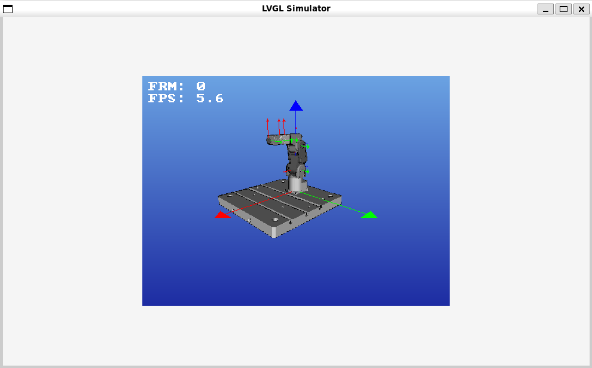

# CNC Machine Controller UI

Welcome to the **CNC Machine Controller UI** project!

This project is designed to provide a user-friendly and efficient interface for controlling CNC machines using the [LVGL (Light and Versatile Graphics Library)](https://lvgl.io/) in C.

The UI features a persistent vertical navigation menu, dynamic footer buttons, and multiple interactive pages to enhance operator interaction and machine control.

---

## Table of Contents

1. [Project Overview](#project-overview)
2. [Directory Structure](#directory-structure)
3. [Detailed File Descriptions](#detailed-file-descriptions)
   - [Root Directory](#root-directory)
   - [Source (`src`) Directory](#source-src-directory)
     - [`app.c` & `app.h`](#appc--apph)
     - [`main.c`](#mainc)
     - [`lvgl_adapter.c` & `lvgl_adapter.h`](#lvgl_adapterc--lvgl_adapterh)
     - [UI Components (`ui`)](#ui-components-ui)
       - [`ui_common.c` & `ui_common.h`](#ui_commonc--ui_commongh)
       - [`ui_header.c` & `ui_header.h`](#ui_headerc--ui_headerh)
       - [`ui_footer.c` & `ui_footer.h`](#ui_footerc--ui_footerh)
       - [`ui_navigation.c` & `ui_navigation.h`](#ui_navigationc--ui_navigationh)
       - [UI Pages (`ui/pages`)](#ui-pages-uipages)
         - [`ui_status_page.c` & `ui_status_page.h`](#ui_status_pagec--ui_status_pageh)
         - [`ui_visualization_page.c` & `ui_visualization_page.h`](#ui_visualization_pagec--ui_visualization_pageh)
         - [`ui_programs_page.c` & `ui_programs_page.h`](#ui_programs_pagec--ui_programs_pageh)
         - [`ui_offsets_page.c` & `ui_offsets_page.h`](#ui_offsets_pagec--ui_offsets_pageh)
         - [`ui_diagnostics_page.c` & `ui_diagnostics_page.h`](#ui_diagnostics_pagec--ui_diagnostics_pageh)
         - [`ui_settings_page.c` & `ui_settings_page.h`](#ui_settings_pagec--ui_settings_pageh)
         - [`ui_dashboard.c` & `ui_dashboard.h`](#ui_dashboardc--ui_dashboardh)
         - [`ui_mdi_page.c` & `ui_mdi_page.h`](#ui_mdi_pagec--ui_mdi_pageh)
     - [Styles (`styles`)](#styles-styles)
       - [`ui_styles.c` & `ui_styles.h`](#ui_stylesc--ui_stylesh)
     - [Data Management (`data`)](#data-management-data)
       - [`data_manager.c` & `data_manager.h`](#data_managerc--data_managerh)
     - [CNC Communication (`cnc`)](#cnc-communication-cnc)
       - [`cnc_communication.c` & `cnc_communication.h`](#cnc_communicationc--cnc_communicationh)
       - [`cnc_state_machine.c` & `cnc_state_machine.h`](#cnc_state_machinec--cnc_state_machineh)
     - [Utilities (`utils`)](#utilities-utils)
       - [`logger.c` & `logger.h`](#loggerc--loggerh)
       - [`config.c` & `config.h`](#configc--configh)
       - [`error_handling.c` & `error_handling.h`](#error_handlingc--error_handlingh)
       - [`user_profiles.c` & `user_profiles.h`](#user_profilesc--user_profilesh)
   - [Assets Directory](#assets-directory)
     - [`images`](#images)
     - [`fonts`](#fonts)
4. [Getting Started](#getting-started)
5. [Contributing](#contributing)
6. [License](#license)

---

## Project Overview

The CNC Machine Controller UI aims to provide operators with a comprehensive and intuitive interface to manage and monitor CNC machine operations. Key features include:

- **Persistent Vertical Navigation Menu**: Located on the far right, ensuring consistent access to all UI pages.
- **Dynamic Footer Buttons**: A footer with 10 buttons where the middle 8 adapt based on the active page, providing relevant controls and actions.
- **Multiple Interactive Pages**: Including Status, Visualization, Programs, Offsets, Diagnostics, Settings, Dashboard, and MDI (Manual Data Input).
- **Modular Codebase**: Each UI component and page is encapsulated within its own module for maintainability and scalability.
- **Consistent Styling**: Uniform look and feel across all UI elements, enhancing user experience.



---

## Directory Structure

```
/project_root
├── cncvis                      # Machine Simulation Module
│   ├── tinygl/                 # TinyGL rendering library
│   ├── libstlio/               # STL file input/output library
│   ├── stb/                    # STB image utilities
│   ├── mxml/                   # Mini-XML parsing library
│   ├── machines/               # Machine configurations
│   │   └── meca500/            # Example robot configuration
│   ├── actor.c/h               # 3D model handling
│   ├── assembly.c/h            # Assembly hierarchy system
│   ├── camera.c/h              # Camera control system
│   ├── light.c/h               # Lighting system
│   ├── config.c/h              # Configuration loading
│   ├── api.c/h                 # Public API for machine simulation
│   ├── osd.c/h                 # On-screen display system
│   └── README.md               # Module-specific documentation
├── main                        # Main application
│   ├── assets/                 #
│   ├── src/                    # Source files
│   |   └── main.c              # Application entry point
|   ├── ui                      # User Interface Module
│   |   └── cnc/                #
│   |   └── data/               #
│   |   └── pages/              # UI pages (status, visualization, etc.)
│   |   └── styles/             # UI styling
│   |   └── utils/              # UI styling
│   |   └── ui_app.c/h          # Main UI initialization
│   └── app.c/h                 # LVGL entry point
├── CMakeLists.txt              # Main CMake configuration
├── README.md                   # This documentation file
└── build/                      # Build output (generated)
```

---

## Detailed File Descriptions

Below is a comprehensive guide to each file and its purpose within the project. This documentation ensures clarity for contributors and maintains consistency across the codebase.

### Root Directory

- **`README.md`**: This file. Provides an overview, setup instructions, and detailed explanations of the project structure and components.

- **`Makefile`**: Build script for compiling the project. Defines compilation rules, dependencies, and build targets. Adjust it according to your development environment and build preferences.

### Source (`src`) Directory

#### `app.c` & `app.h`

- **`app.c`**: Implements the `app_init` function, orchestrating the initialization sequence of the entire application. This includes initializing LVGL, the Hardware Abstraction Layer (HAL), UI styles, common UI components (header, footer, navigation menu), and setting up the initial UI page.

- **`app.h`**: Header file declaring the `app_init` function and any related declarations necessary for initializing the application.

#### `main.c`

- **`main.c`**: The entry point of the application. It calls `app_init` to initialize the system and enters the main loop, handling LVGL tasks and ensuring the UI remains responsive. It typically contains an infinite loop where `lv_task_handler()` is called, and delays (e.g., `usleep`) are implemented to manage CPU usage.

#### `lvgl_adapter.c` & `lvgl_adapter.h`

- **`lvgl_adapter.c`**: Contains hardware-specific implementations required by LVGL. This includes initializing display drivers, input devices, tick timers, and any other hardware integrations needed for LVGL to function correctly on your target platform.

- **`lvgl_adapter.h`**: Header file declaring functions and variables defined in `lvgl_adapter.c`, allowing other modules to interact with the LVGL adapter.

#### UI Components (`ui`)

##### `ui_common.c` & `ui_common.h`

- **`ui_common.c`**: Manages the initialization and cleanup of common UI components shared across all pages, such as the header, footer, and possibly other persistent elements. It ensures that these components are created during application startup and appropriately cleaned when switching pages.

- **`ui_common.h`**: Header file declaring functions like `ui_common_init()` and `ui_common_clean()`, allowing other modules to initialize or clean the common UI components.

##### `ui_header.c` & `ui_header.h`

- **`ui_header.c`**: Implements the creation and styling of the header section of the UI. The header typically includes elements like the program name, machine status indicators, and the current time. It defines a function `ui_header_create()` to set up the header and `ui_header_get_obj()` to retrieve the header object.

- **`ui_header.h`**: Header file declaring `ui_header_create()` and `ui_header_get_obj()`, allowing other modules to create and interact with the header.

##### `ui_footer.c` & `ui_footer.h`

- **`ui_footer.c`**: Manages the footer section, which includes 10 buttons where the first and last are scroll arrows, and the middle 8 are dynamic buttons that change based on the active UI page. It defines functions to create the footer (`ui_footer_create()`), register page-specific footer buttons (`footer_register_buttons()`), clear buttons (`footer_clear_buttons()`), and handle scrolling events.

- **`ui_footer.h`**: Header file declaring functions for managing the footer, including `ui_footer_create()`, `footer_register_buttons()`, and event handlers for scrolling.

##### `ui_navigation.c` & `ui_navigation.h`

- **`ui_navigation.c`**: Implements the persistent vertical navigation menu located on the far right of the screen. It creates a set of buttons/icons representing different UI pages (e.g., Status, Visualization, Programs). Each navigation button has an associated event handler to switch to the corresponding UI page.

- **`ui_navigation.h`**: Header file declaring functions like `ui_navigation_init()`, `ui_navigation_clean()`, and getter functions to retrieve the navigation menu object (`ui_navigation_get_obj()`).

##### `ui_dashboard.c` & `ui_dashboard.h`

- **`ui_dashboard.c`**: Defines the Dashboard Page, including its specific footer buttons and their event handlers. It creates widgets like parts produced counters and spindle load indicators, and sets up timers to update dashboard metrics in real-time.

- **`ui_dashboard.h`**: Header file declaring the `ui_dashboard_create()` function and footer button event handlers specific to the Dashboard Page.

##### `ui_mdi_page.c` & `ui_mdi_page.h`

- **`ui_mdi_page.c`**: Implements the MDI (Manual Data Input) Page, allowing operators to manually enter and submit G-Code commands. It includes footer buttons for submitting and clearing input, and defines event handlers to process these actions.

- **`ui_mdi_page.h`**: Header file declaring the `ui_mdi_page_create()` function and event handlers for MDI-specific footer buttons.

##### `pages/ui_status_page.c` & `pages/ui_status_page.h`

- **`ui_status_page.c`**: Implements the Status Page, displaying real-time information about the CNC machine's axes (X, Y, Z, etc.). It defines footer buttons relevant to machine control, such as Feed, Speed, Spindle, Coolant, etc., and their respective event handlers.

- **`ui_status_page.h`**: Header file declaring the `ui_status_page_create()` function and footer button event handlers specific to the Status Page.

##### `pages/ui_visualization_page.c` & `pages/ui_visualization_page.h`

- **`ui_visualization_page.c`**: Defines the Visualization Page, which includes a 3D toolpath viewer and toolpath summary. It sets up footer buttons like Zoom In, Zoom Out, Pan, Rotate, etc., and their event handlers to control the visualization.

- **`ui_visualization_page.h`**: Header file declaring the `ui_visualization_page_create()` function and event handlers for Visualization Page footer buttons.

##### `pages/ui_programs_page.c` & `pages/ui_programs_page.h`

- **`ui_programs_page.c`**: Implements the Programs Page, allowing operators to manage CNC programs. Features include loading, editing, simulating, running, pausing, stopping, deleting, and viewing info about programs. It defines corresponding footer buttons and event handlers.

- **`ui_programs_page.h`**: Header file declaring the `ui_programs_page_create()` function and footer button event handlers specific to the Programs Page.

##### `pages/ui_offsets_page.c` & `pages/ui_offsets_page.h`

- **`ui_offsets_page.c`**: Defines the Offsets Page, enabling operators to manage work and tool offsets. It includes functionalities like setting, clearing, auto-setting, resetting, exporting, and importing offsets. Footer buttons and their event handlers are tailored to these actions.

- **`ui_offsets_page.h`**: Header file declaring the `ui_offsets_page_create()` function and footer button event handlers for the Offsets Page.

##### `pages/ui_diagnostics_page.c` & `pages/ui_diagnostics_page.h`

- **`ui_diagnostics_page.c`**: Implements the Diagnostics Page, providing tools for machine diagnostics and troubleshooting. It may include status indicators, error logs, and diagnostic tools. Footer buttons allow operators to perform diagnostic actions.

- **`ui_diagnostics_page.h`**: Header file declaring the `ui_diagnostics_page_create()` function and event handlers for Diagnostics Page footer buttons.

##### `pages/ui_settings_page.c` & `pages/ui_settings_page.h`

- **`ui_settings_page.c`**: Defines the Settings Page, where operators can configure system settings, preferences, and other configurable parameters. Footer buttons facilitate saving, resetting, or applying settings.

- **`ui_settings_page.h`**: Header file declaring the `ui_settings_page_create()` function and footer button event handlers for the Settings Page.

#### Styles (`styles`)

##### `ui_styles.c` & `ui_styles.h`

- **`ui_styles.c`**: Implements various styles used across the UI to ensure a consistent and visually appealing interface. This includes styles for buttons, labels, headers, footers, navigation menu, and other UI elements. It defines and initializes LVGL `lv_style_t` structures.

- **`ui_styles.h`**: Header file declaring all the style variables (e.g., `style_btn`, `style_nav_btn`, `style_label`) and the `styles_init()` function to initialize these styles during application startup.

#### Data Management (`data`)

##### `data_manager.c` & `data_manager.h`

- **`data_manager.c`**: Handles data-related operations such as loading, saving, and managing machine configurations, user profiles, and program data. It interfaces with storage systems (e.g., EEPROM, SD cards) to persist data across sessions.

- **`data_manager.h`**: Header file declaring functions and data structures for managing application data, allowing other modules to access and manipulate stored data.

#### CNC Communication (`cnc`)

##### `cnc_communication.c` & `cnc_communication.h`

- **`cnc_communication.c`**: Manages the communication between the UI and the CNC machine's controller. This includes sending commands, receiving status updates, and handling real-time data streams. It ensures reliable and efficient data exchange to facilitate machine control.

- **`cnc_communication.h`**: Header file declaring functions and variables necessary for CNC communication, enabling other modules to send commands or request data from the CNC controller.

##### `cnc_state_machine.c` & `cnc_state_machine.h`

- **`cnc_state_machine.c`**: Implements the CNC machine's state machine, managing different operational states (e.g., Ready, Running, Paused, Error). It handles state transitions based on user inputs, machine status, and predefined conditions.

- **`cnc_state_machine.h`**: Header file declaring the state machine's states, events, and transition functions, allowing other modules to interact with the machine's operational state.

#### Utilities (`utils`)

##### `logger.c` & `logger.h`

- **`logger.c`**: Provides logging functionalities to record system events, errors, and informational messages. It facilitates debugging and monitoring by maintaining logs of user interactions and system behaviors.

- **`logger.h`**: Header file declaring logging functions (e.g., `log_info()`, `log_error()`) that can be used across the application to log messages at different severity levels.

##### `config.c` & `config.h`

- **`config.c`**: Manages application configuration settings, including loading configurations from files or storage, applying default settings, and saving updated configurations. It ensures that user preferences and system settings are maintained.

- **`config.h`**: Header file declaring configuration management functions and data structures, allowing other modules to access and modify configuration settings.

##### `error_handling.c` & `error_handling.h`

- **`error_handling.c`**: Implements error handling mechanisms to detect, report, and recover from errors or exceptional conditions within the application. It ensures system stability and provides feedback to users when issues arise.

- **`error_handling.h`**: Header file declaring error handling functions and error codes, enabling other modules to report and respond to errors consistently.

##### `user_profiles.c` & `user_profiles.h`

- **`user_profiles.c`**: Manages user profiles, allowing different operators to have personalized settings and preferences. It handles user authentication, profile creation, and switching between profiles.

- **`user_profiles.h`**: Header file declaring functions and data structures for managing user profiles, facilitating user-specific customization across the UI.

### Assets Directory

#### `images`

- **Purpose**: Stores all image assets used within the UI, such as icons, backgrounds, and other graphical elements. These images are referenced by the UI components to enhance visual appeal and usability.

- **Content Examples**:
  - Icons for navigation buttons.
  - Background images for different UI pages.
  - Logos or branding elements.

#### `fonts`

- **Purpose**: Contains custom font files utilized by LVGL to render text within the UI. Custom fonts ensure readability and aesthetic consistency across different languages and symbol sets.

- **Content Examples**:
  - TrueType Fonts (`.ttf`) for labels and buttons.
  - Symbol fonts for icons and special symbols.

### LVGL Directory

- **`lvgl`**: Contains the LVGL library files or is included as a submodule. LVGL is the graphics library used to create the UI elements, handle rendering, and manage input devices.

- **Content**:
  - LVGL source code.
  - Configuration files for LVGL.
  - Any custom extensions or modules for LVGL.

---

## Getting Started

To get started with the CNC Machine Controller UI project, follow these steps:

1. **Clone the Repository**:
   ```bash
   git clone https://github.com/agentdavo/uCNC-machineSimModule.git
   cd uCNC-machineSimModule

   ```

2. **Initialize and Update Submodules** (if applicable):
   ```bash
   git submodule update --init --recursive
   ```

3. **Install Dependencies**:
   - Ensure you have the required toolchain installed (e.g., GCC for your target platform).
   - Install LVGL and any other necessary libraries.

4. **Build the Project**:
   ```bash
   make
   ```

5. **Run the Application**:
   - Upload the compiled binary to your CNC machine's controller.
   - Alternatively, use an emulator or simulation environment for testing.

6. **Configuration**:
   - Modify configuration files in the `data` directory as needed.
   - Customize styles in `styles/ui_styles.c`.

---

## Contributing

Contributions are welcome! To contribute to the CNC Machine Controller UI project:

1. **Fork the Repository**:
   - Click the "Fork" button on the repository page to create your own copy.

2. **Create a Feature Branch**:
   ```bash
   git checkout -b feature/YourFeatureName
   ```

3. **Commit Your Changes**:
   ```bash
   git commit -m "Add feature: YourFeatureDescription"
   ```

4. **Push to Your Fork**:
   ```bash
   git push origin feature/YourFeatureName
   ```

5. **Submit a Pull Request**:
   - Navigate to your fork on GitHub.
   - Click "Compare & pull request" and provide a detailed description of your changes.

**Please ensure that your contributions adhere to the project's coding standards and include appropriate documentation and tests.**

---

## License

This project is licensed under the [MIT License](LICENSE). You are free to use, modify, and distribute this software under the terms of the license. See the [LICENSE](LICENSE) file for more details.

---

## Acknowledgments

- **LVGL**: Thanks to the developers of LVGL for providing a powerful and flexible graphics library.
- **Open Source Community**: For their continuous support and contributions to the CNC and embedded systems ecosystems.

---
