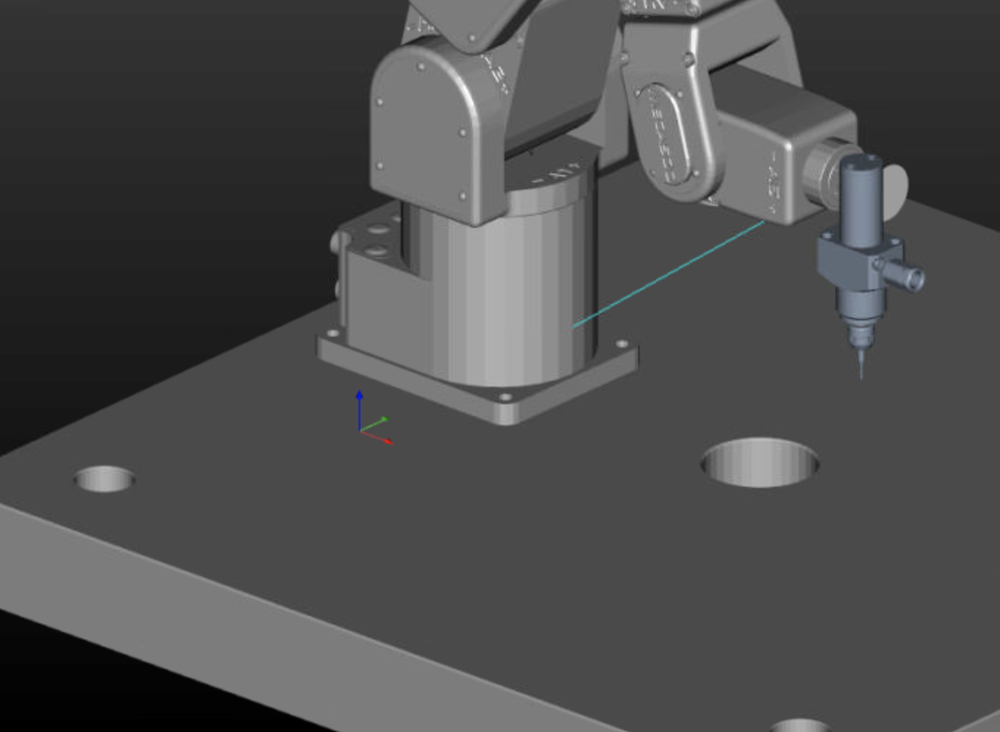

# CNC Machine Rendering Framework

A high-performance CNC machine rendering framework for robot arms, implemented in C using GNU99 and the enhanced TinyGL by Fabrice Bellard. This framework enables you to load STL models, assemble them hierarchically, and render high-quality images with dynamic camera controls and comprehensive performance profiling.

## 🚀 Features

- **Modular Architecture:** Structured organization for Actors, Assemblies, and Camera.
- **STL File Support:** Load and render STL files using `libstlio`.
- **Hierarchical Assembly:** Easily assemble complex robot arms from individual parts.
- **Dynamic Camera Controls:** Orbit the camera around the scene to create smooth animations.
- **Performance Profiling:** Detailed breakdown of rendering times for optimization.
- **Frame Buffer Reuse:** Efficient rendering by reusing the framebuffer across frames.
- **Image Export:** Save rendered frames as high-quality PNG images using `stb_image_write`.
- **Multithreading Support:** Utilize OpenMP for accelerated rendering and post-processing.
- **Enhanced TinyGL Features:**
  - **SIMD Acceleration:** Improved vertex processing speed with `alignas` support.
  - **Additional OpenGL Functions:** Extended functionality including `glDeleteList`, `glSetEnableSpecular`, `glDrawText`, and more.
  - **Post-Processing:** Fast, multithreaded post-processing with `glPostProcess()`.
  - **Buffer Management:** Server-side buffers with `glGenBuffers`, `glBindBuffer`, and related functions.
  - **Improved Safety:** Comprehensive `glGetError()` functionality and memory leak fixes.
  - **Customizable Texture Sizes:** Compile-time options to set texture sizes as powers of two.

## 📋 Requirements

- **Compiler:** GCC supporting GNU99.
- **Libraries:**
  - [TinyGL](https://github.com/C-Chads/tinygl) by Fabrice Bellard (Enhanced Fork by C-Chads)
  - [libstlio](https://github.com/Linden/libstlio) for STL file handling
  - [stb_image_write](https://github.com/nothings/stb) for image exporting
  - [OpenMP](https://www.openmp.org/) for multithreading support
- **Headers and Libraries:** Ensure all necessary headers and libraries are installed and accessible.

## 🛠 Installation

Follow these steps to set up and compile the **CNC Machine Rendering Framework**:

### 1. **Clone the Repository**

Begin by cloning the repository to your local machine:

```bash
git clone https://github.com/agentdavo/uCNC-machineSimModule.git
cd uCNC-machineSimModule
git submodule update --init --recursive
```

### 2. **Ensure Dependencies Are Present**

Make sure the following directories and their contents are correctly placed within the project:

- **TinyGL:**
  - Located in the `tinygl/` directory.
  - Contains `include/` and `src/` subdirectories with necessary header and source files.

- **libstlio:**
  - Located in the `libstlio/` directory.
  - Contains `include/` and `src/` subdirectories with necessary header and source files.

- **stb_image_write:**
  - Located in the `stb/` directory as `stb_image_write.h`.
  - Ensure it's correctly placed for the compiler to locate.

Your project directory should resemble the following structure:

```
project/
├── Makefile
├── render_robot.c
├── stb/
│   └── stb_image_write.h
├── tinygl/
│   ├── include/
│   │   └── gl.h
│   └── src/
│       ├── zbuffer.c
│       ├── gl.c
│       └── ... (other TinyGL source files)
├── libstlio/
│   ├── include/
│   │   └── stlio.h
│   └── src/
│       ├── stlio.c
│       └── ... (other libstlio source files)
└── ... (other project files)
```

> **Note:** Ensure that all subdirectories (`tinygl/`, `libstlio/`, and `stb/`) contain the necessary files as per the directory structure.

### 3. **Compile the CNC Rendering Framework**

The provided `Makefile` automates the compilation process, handling the building of TinyGL and libstlio, as well as compiling and linking the main application.

Run the following command in the root directory of the project:

```bash
make
```

**What This Does:**

- **Compiles TinyGL:**
  - Compiles all `.c` files within `tinygl/src/` into object files (`.o`).
  - Archives these object files into the static library `libtinygl.a`.

- **Compiles libstlio:**
  - Compiles all `.c` files within `libstlio/src/` into object files (`.o`).
  - Archives these object files into the static library `libstlio.a`.

- **Compiles Main Application:**
  - Compiles `render_robot.c` into `render_robot.o`, ensuring it includes `stb_image_write.h` from the `stb/` directory.

- **Links Executable:**
  - Links `render_robot.o` with `libtinygl.a` and `libstlio.a` to produce the final executable `render_robot`.

**Optimizations Included:**

- **`-O3`:** Enables high-level optimizations for maximum performance.
- **`-std=gnu99`:** Uses the GNU99 standard for C.
- **`-fopenmp`:** Enables OpenMP for multithreading support.
- **Include Paths:** Ensures the compiler locates header files in `tinygl/include/`, `libstlio/include/`, and `stb/`.

### 4. **Optional: Use Parallel Compilation**

To speed up the build process by utilizing multiple CPU cores, you can invoke `make` with the `-j` flag followed by the number of jobs. For example, to use all available cores:

```bash
make -j$(nproc)
```

This command tells `make` to execute multiple compilation jobs in parallel, significantly reducing build times on multi-core systems.

## 🎮 Usage

Execute the compiled program with optional command-line arguments to customize the rendering process.

```bash
./render_robot [totalFrames] [rotationSpeed] [radius] [elevation]
```

### 📄 Command-Line Arguments

1. **`totalFrames`** (optional):  
   Number of frames to render for a full 360-degree rotation.  
   *Default:* `36`

2. **`rotationSpeed`** (optional):  
   Degrees to rotate the camera per frame.  
   *Default:* `10.0`

3. **`radius`** (optional):  
   Distance of the camera from the origin (center of the robot arm).  
   *Default:* `400.0`

4. **`elevation`** (optional):  
   Height of the camera above the ground plane.  
   *Default:* `100.0`

### 📚 Examples

- **Default Settings:**
  ```bash
  ./render_robot
  ```
  Renders 36 frames, rotating 10 degrees per frame, with a camera radius of 400 units and elevation of 100 units.

- **Custom Settings:**
  ```bash
  ./render_robot 60 6 500 150
  ```
  Renders 60 frames, rotating 6 degrees per frame, with a camera radius of 500 units and elevation of 150 units.

## 🖼 Output

- **Rendered Images:**  
  PNG images named `meca500_robot_frame_001.png` to `meca500_robot_frame_036.png` (or according to the specified `totalFrames`).

- **Profiling Information:**  
  Detailed timing information is printed to the console for each frame, including camera setup, scene rendering, image saving, and total frame time. After all frames are rendered, a summary of the profiling statistics is displayed.



### 📊 Sample Console Output

```
Frame 001: meca500_robot_frame_001.png | Camera Setup: 0.25 ms | Scene Render: 50.30 ms | Image Save: 30.45 ms | Total: 81.00 ms
Frame 002: meca500_robot_frame_002.png | Camera Setup: 0.20 ms | Scene Render: 50.10 ms | Image Save: 30.50 ms | Total: 80.80 ms
...
=== Performance Profiling Summary ===
Total Frames Rendered: 36

Camera Setup Time (ms):
  Total: 9.00
  Average: 0.25
  Min: 0.20
  Max: 0.30

Scene Render Time (ms):
  Total: 1800.00
  Average: 50.00
  Min: 49.50
  Max: 50.50

Image Save Time (ms):
  Total: 1096.20
  Average: 30.45
  Min: 30.00
  Max: 31.00

Total Frame Time (ms):
  Total: 2700.00
  Average: 75.00
  Min: 74.50
  Max: 75.50
====================================
```

## 🧹 Cleanup

To remove all compiled object files, static libraries, and the executable, run:

```bash
make clean
```

**What This Does:**

- Removes all `.o` files within `tinygl/src/` and `libstlio/src/`.
- Deletes the static libraries `libtinygl.a` and `libstlio.a`.
- Deletes the main object file `render_robot.o`.
- Deletes the final executable `render_robot`.

**Sample Output:**

```
Cleaning build artifacts...
Clean complete.
```

## 🐞 Troubleshooting

- **Failed to Load STL Files:**
  - Ensure that the STL files are present in the working directory.
  - Verify file permissions and paths.

- **Framebuffer Initialization Failure:**
  - Check that TinyGL is correctly installed and configured.
  - Ensure that your system meets the necessary requirements for framebuffer operations.

- **Image Saving Issues:**
  - Verify that the `stb_image_write.h` is correctly included and accessible in the `stb/` directory.
  - Ensure there is sufficient disk space and write permissions in the output directory.

- **Multithreading Issues:**
  - Ensure that the compiler supports OpenMP (`-fopenmp` flag).
  - Verify that your system's hardware supports multithreading if leveraging OpenMP features.

- **Makefile Errors:**
  - Ensure that all dependencies are correctly placed in their respective directories.
  - Verify that `stb_image_write.h` is located in the `stb/` directory.
  - Check for typos or incorrect paths in the `Makefile`.

## 📝 Contributing

Contributions are welcome! Please fork the repository and submit a pull request with your enhancements or bug fixes.

## 📄 License

This project is licensed under the [MIT License](LICENSE).

## 📚 Additional Resources

- **TinyGL Documentation:**  
  Refer to the [TinyGL README](https://github.com/C-Chads/tinygl) for more detailed information on TinyGL's features and usage.

- **libstlio Documentation:**  
  Visit the [libstlio repository](https://github.com/Linden/libstlio) for detailed instructions on handling STL files.

- **stb_image_write Documentation:**  
  Explore the [stb_image_write repository](https://github.com/nothings/stb) for more information on image exporting capabilities.

## 🔧 Enhancements Using Enhanced TinyGL C-Chads Features

Leveraging the enhanced features of TinyGL can further optimize and expand the capabilities of the CNC Machine Rendering Framework:

- **SIMD Acceleration:**
  - Enable `alignas` in `zfeatures.h` to take advantage of SIMD optimizations, significantly improving vertex processing speed.

- **Multithreading with OpenMP:**
  - Utilize OpenMP to parallelize rendering tasks, such as `glDrawPixels` and `glPostProcess()`, to maximize performance on multi-core processors.

- **Advanced Buffer Management:**
  - Implement server-side buffers using `glGenBuffers`, `glBindBuffer`, and related functions to manage vertex and texture data more efficiently.

- **Post-Processing Effects:**
  - Use `glPostProcess()` to apply custom post-processing effects to rendered frames, enhancing visual quality or adding specific graphical features.

- **Extended OpenGL Functions:**
  - Incorporate additional OpenGL functions like `glDrawText`, `glSetEnableSpecular`, and `glGetTexturePixmap` to add more functionality, such as text rendering and advanced lighting controls.

- **Error Handling and Debugging:**
  - Enable comprehensive `glGetError()` functionality to aid in debugging and ensure rendering correctness.

### 📌 Example: Using `glDrawText` for Annotations

Enhance your rendered images by adding text annotations directly onto the framebuffer.

```c
// Before rendering the scene
glColor3f(1.0f, 1.0f, 1.0f); // Set text color to white
glDrawText("Robot Arm", 10, 10, 0xFFFFFFFF);
```

### 📌 Example: Implementing Custom Post-Processing

Apply a custom post-processing effect to invert the colors of the rendered frame.

```c
GLuint invertColors(GLint x, GLint y, GLuint pixel, GLushort z) {
    unsigned char r = (pixel >> 24) & 0xFF;
    unsigned char g = (pixel >> 16) & 0xFF;
    unsigned char b = (pixel >> 8) & 0xFF;
    unsigned char a = pixel & 0xFF;
    return (255 - r) << 24 | (255 - g) << 16 | (255 - b) << 8 | a;
}

int main(int argc, char *argv[]) {
    // ... [Initialization code]

    // Set the post-processing function
    glPostProcess(invertColors);

    // ... [Rendering loop]
}
```

## 📈 Performance Optimization Tips

- **Enable OpenMP:**  
  Ensure that the `-fopenmp` flag is used during compilation to activate multithreading features.

- **SIMD Optimizations:**  
  Enable `alignas` in `zfeatures.h` to allow TinyGL to utilize SIMD instructions, boosting vertex processing speed.

- **Minimize State Changes:**  
  Reduce the number of OpenGL state changes (e.g., binding buffers, setting colors) within the rendering loop to enhance performance.

- **Batch Rendering Calls:**  
  Group similar rendering operations together to take full advantage of TinyGL's optimized rasterizer and avoid redundant computations.

## 🤝 Acknowledgments

- **[Fabrice Bellard](https://bellard.org/):** Creator of the original TinyGL.
- **[C-Chads](https://github.com/C-Chads/tinygl):** Maintainers of the enhanced TinyGL fork with additional features and optimizations.
- **[stb Libraries](https://github.com/nothings/stb):** For providing `stb_image_write.h`.
- **[libstlio](https://github.com/Linden/libstlio):** For facilitating STL file handling.

## 🗺 Roadmap

- **Texture Filtering:**  
  Implement mipmapping and various texture filtering techniques for higher-quality textures.

- **Advanced Lighting Models:**  
  Expand lighting capabilities beyond specular to include more realistic shading effects.

- **User Interface Integration:**  
  Incorporate more advanced GUI features using the included OpenIMGUI standard.

- **Extended OpenGL Support:**  
  Gradually implement additional OpenGL 1.1 features to increase compatibility and functionality.

- **Documentation Enhancements:**  
  Provide more comprehensive documentation and examples to aid new users in utilizing the framework's full potential.